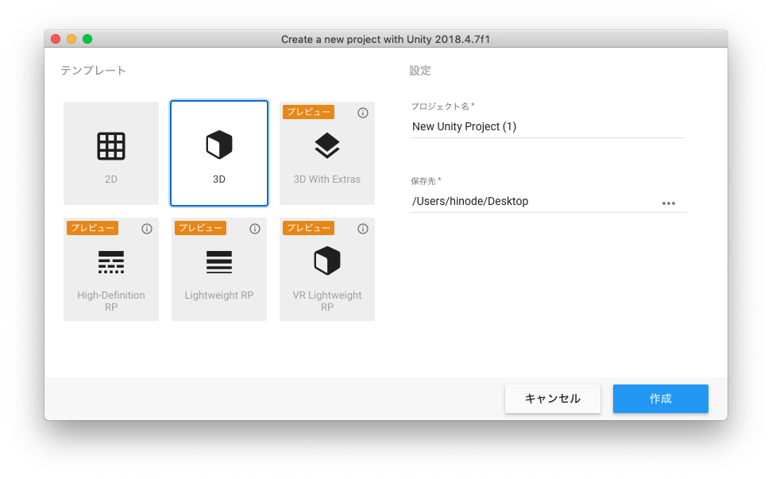
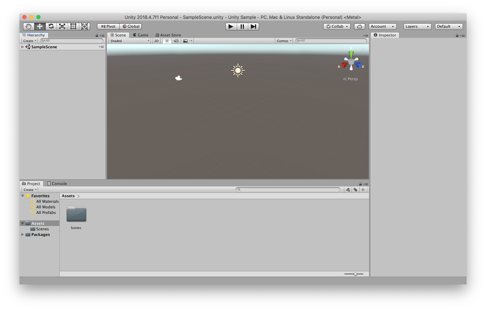
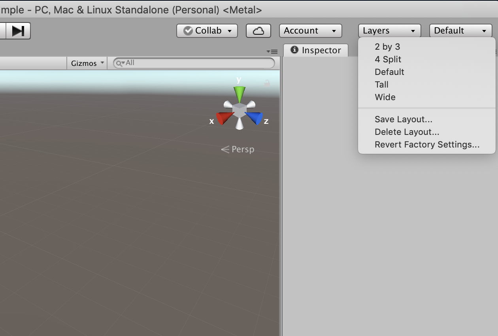
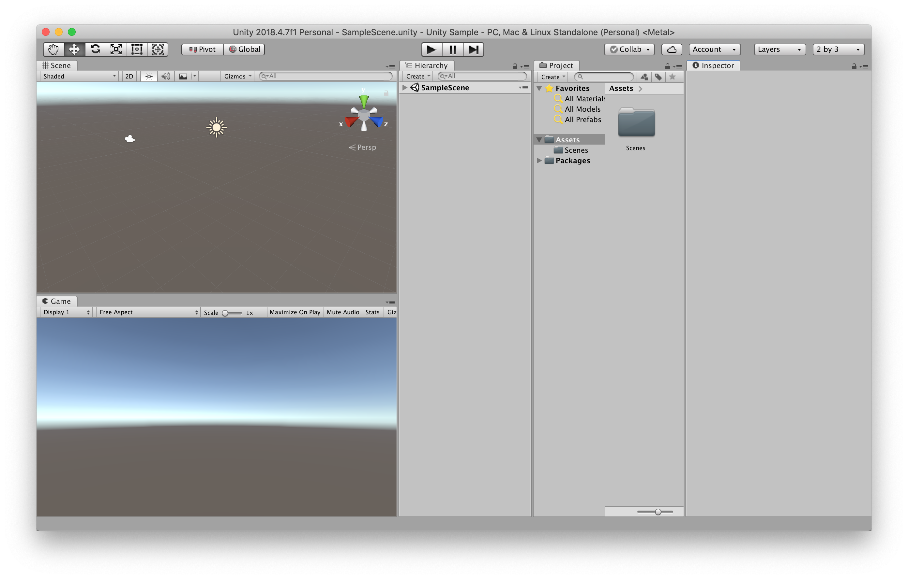
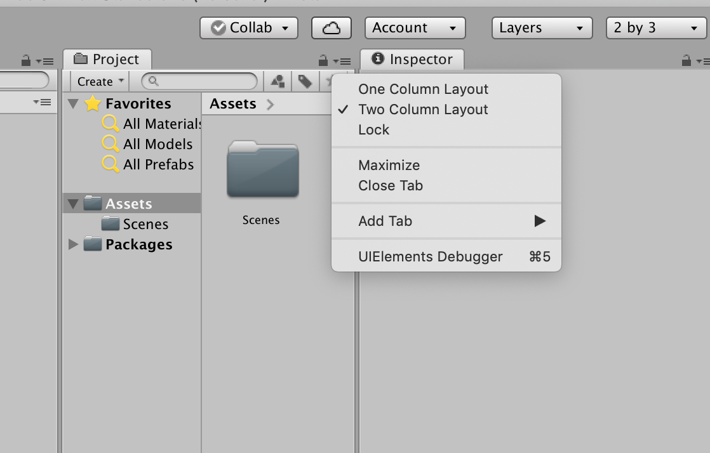
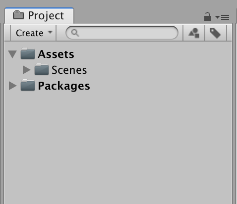
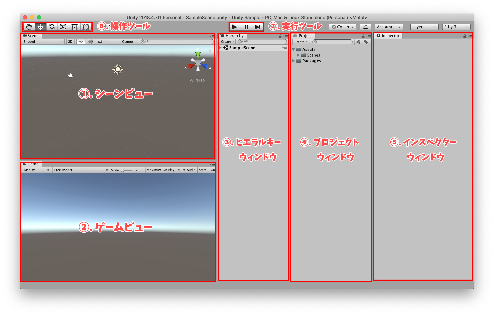

# Unityを起動しよう
まずはUnityを起動しましょう。

Unityを起動すると、上の画像のようにUnityプロジェクトの作成画面になります。

左のテンプレートで2Dか3Dかを選択します。今回は3Dにします。

プロジェクト名は「Unity Sample」としてください。
 
 

>もし同じサーバー内に同時に保存する場合は、名前の前に学籍番号などをつけて自分のプロジェクトだとわかるようにしてください。

 
 
保存先は指定の場所に保存してください。特に指定がなかったら、デスクトップに保存しましょう。

全て設定が終わったら右下の作成ボタンを押してください。

しばらく待つとUnityの開発画面が開かれます。
 
 
***

# Unityの画面構成

## レイアウトのカスタマイズ

Unityが開かれると、下の画像のような画面が出てきます。

これがUnityのデフォルトの開発画面なのですが、少しわかりにくいので画面を変えたいと思います。

 
 

Unityの右上に「Default」のボタンがあるので、そちらを押して表示された中から「2 by 3」を選択してください。

 
 

そうすると、下の画像のようになりました。もう少し変更します。

 
 

Projectウィンドウの右側の三本線のアイコンをクリックしてください。そして、出てきたリストの中から「One Column Layout」を選択しましょう。

 
 

そうすると、このようにProjectウィンドウが見やすくなります。

 
 

これで画面のカスタマイズは完了です。

今回は「2 by 3」の画面で進めますが、開発画面は自分のやりやすいレイアウトで問題ありません。

 
 

## 画面の構成

Unityの画面構成は主に以下のようになっています。

